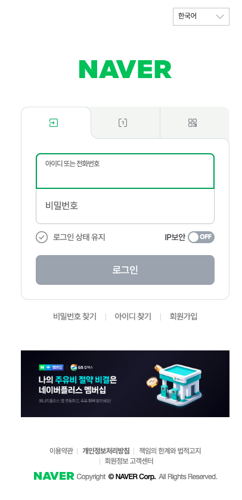
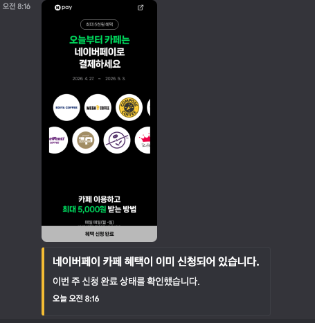

# Naver Coffee Benefit Automation

매주 월요일 네이버페이 카페 이벤트 페이지에 접속해 `혜택 신청하기` 버튼을 누르고, 결과를 디스코드 웹훅으로 보냅니다.

## 준비

```bash
npm install
npm run install-browser
cp .env.example .env
```

`.env`에서 `DISCORD_WEBHOOK_URL`을 실제 디스코드 웹훅 URL로 바꿔 주세요.

## 최초 로그인 세션 저장

```bash
npm run setup-login
```

브라우저가 열리면 아래와 같이 네이버 로그인 화면이 뜰 수 있습니다. **아이디·비밀번호로 로그인**을 완료한 뒤, 이벤트 페이지가 로그인된 상태로 보이는지 확인하고 터미널에서 **Enter**를 누르세요.



## 수동 실행

```bash
npm run apply
```

브라우저 화면을 보면서 디버깅하려면 다음 명령을 사용합니다.

```bash
npm run apply:headed
```

## 디스코드 알림

`.env`에 `DISCORD_WEBHOOK_URL`을 넣어 두면, 스크립트가 끝날 때마다 디스코드 채널로 **웹페이지 스크린샷**과 함께 **이번 주 혜택 상태**(이미 신청됨, 신청 완료, 로그인 만료 등)가 임베드로 전송됩니다.

> [!IMPORTANT]
> **디스코드 웹훅 없이 두는 경우:** 웹훅을 비워 두거나 `DISCORD_WEBHOOK_URL`을 넣지 않으면 디스코드로는 **아무 요청도 하지 않습니다.** 다만 **페이지 접속·신청 처리·로컬 `screenshots/` 저장은 그대로 진행되고**, 종료 요약만 터미널에 `[discord skipped]` 로그로 남습니다.



## 매주 월요일 자동 실행

자동 신청 시간은 모두 **매주 월요일 오전 8시(로컬 타임존)** 기준입니다.

### macOS (launchd)

```bash
npm run launchd:install
```

로그는 `logs/launchd.out.log`, `logs/launchd.err.log`에 저장됩니다. 등록된 작업의 시간은 `scripts/install-launchd.sh` 안의 `Hour` 값으로 설정되어 있습니다.

### Linux (cron)

프로젝트 절대 경로를 실제 값으로 바꾼 뒤 `crontab -e`에 한 줄 추가합니다.

```cron
0 8 * * 1 cd /path/to/naver-coffee && /usr/bin/env npm run apply >> logs/cron.log 2>&1
```

처음 실행 전에 로그 디렉터리를 만들어 두면 좋습니다.

```bash
mkdir -p logs
```

### Windows (작업 스케줄러)

1. 작업 스케줄러를 연 뒤 **작업 만들기**를 선택합니다.
2. **일반**: 이름을 예를 들어 `NaverCoffeeApply`처럼 지정하고, **사용자가 로그온할 때만 실행 여부**는 환경에 맞게 선택합니다 (로그인한 세션으로만 브라우저가 필요하면 로그온 시).
3. **트리거**: **새로 만들기** → **매주** → 요일에서 **월요일**만 선택 → 시작 시간 **오전 8:00:00**.
4. **동작**: **새로 만들기** → **프로그램 시작**  
   - **프로그램/스크립트**: 저장소 안의 배치 파일  
     예: `C:\Users\내이름\projects\naver-coffee\scripts\run-apply.bat`  
     (`run-apply.bat`은 프로젝트 루트에서 `npm run apply`를 실행하고 출력을 `logs\cron.log`에 붙입니다.)

또는 **프로그램**: `npm`의 전체 경로(`where npm`으로 확인한 `npm.cmd`), **인수 추가**: `run apply`, **시작 위치**에 해당 프로젝트 폴더 경로를 넣어도 됩니다.

로그 확인: 프로젝트 루트의 `logs\cron.log` (배치 사용 시).

---

## 동작 방식

- `혜택 신청 완료` 문구가 보이면 이미 신청된 상태로 알립니다.
- `혜택 신청하기` 문구가 보이면 버튼을 클릭하고 완료 여부를 다시 확인합니다.
- 로그인 페이지나 로그인 문구가 감지되면 세션 만료로 판단하고 재로그인 알림을 보냅니다.
- 각 실행마다 `screenshots/`에 화면 캡처를 저장합니다. 디스코드 웹훅이 설정되어 있으면 같은 스크린샷을 메시지에 첨부해 보냅니다.
